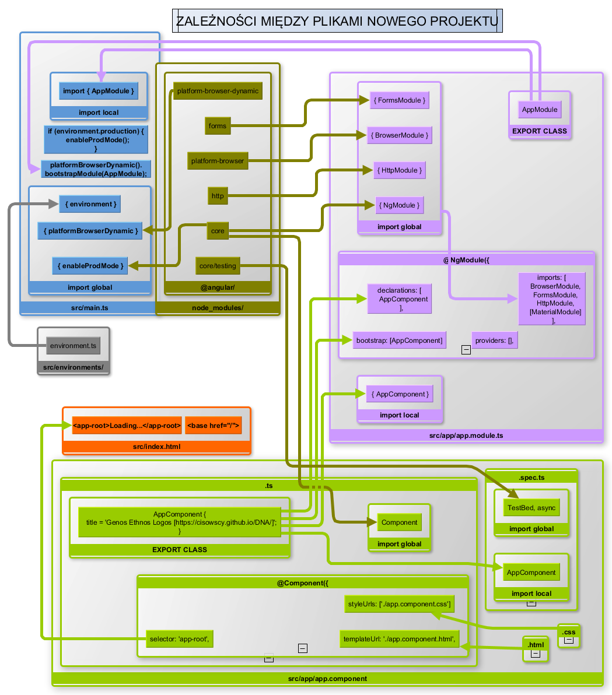

# DNA - Genos Ethnos Logos [https://cisowscy.github.io/DNA/]


## Development (co będzie potrzebne..)
-  [Node.js 7.5](https://nodejs.org/en/)
-  [Microsoft Visual Code](https://code.visualstudio.com/insiders) lub [Atom](https://atom.io/beta); przydatny może się okazać plugin do MSVscdoe [ngdoc](http://www.angulardoc.io)
-  [Chrome](https://www.google.pl/chrome/browser/canary.html) i plugin do debugowania Angulara [Augury](https://augury.angular.io/)
-  [yarn](https://yarnpkg.com/lang/en/)
-  [cmder](http://cmder.net/)

następnie
```bash
$ npm i -g npm@latest
$ npm i -g @angular/cli@latest
$ git clone https://github.com/Cisowscy/DNA.git
$ cd DNA
$ yarn install
$ start https:\\localhost:4200\
$ ng serve 
```
Opcjonalnie jeśli podczas kompilacji wystpi nadal!! [błąd `Error Could not resolve module opaque_token ` może być potrzebne dodatkowe doinstalowanie CLI lokalnie (npm link)](https://github.com/angular/angular-cli/issues/4611)
```bash
$ npm i --save-dev @angular/cli@latest
```
# co ja tu kodzę ;)
Generalnie chcę utworzyć niezależne środowisko genealogiczno-genetyczne.. ale to kiedyś...

**Doraźny cel:** utworzyć aplikację o dwojakim biegu ( generowanie przykładowej rodziny lub import z gedcom) do wizualizacji przepływu dna, i kożyści płynących z zbadania konkretnych przedstawicieli rodziny 

> ## Czego używam
>
> Biblioteki: | [Google TypeScript Angular 4.0.0.beta-7](https://github.com/angular/angular/tree/4.0.0-beta.7) | [angular-material 2.0.0.beta-2](https://github.com/angular/material2/tree/2.0.0-beta.2) |
>
> Języki :  | [HTML (5.1/5.2)](https://www.w3.org/TR/html/)  |  [TypeScript (2.1.6)](https://www.typescriptlang.org/) | [SCSS (Sass 3.5)](http://sass-lang.com/) |

## KOMENDY: CLI 1.0.0-beta.32.3


> ## WPROWADZENIE

> 
> 

# --------------

This project was generated with [Angular CLI](https://github.com/angular/angular-cli) version 1.0.0-beta.32.3.

## Development server
Run `ng serve` for a dev server. Navigate to `http://localhost:4200/`. The app will automatically reload if you change any of the source files.

## Code scaffolding

Run `ng generate component component-name` to generate a new component. You can also use `ng generate directive/pipe/service/class/module`.

## Build

Run `ng build` to build the project. The build artifacts will be stored in the `dist/` directory. Use the `-prod` flag for a production build.

## Running unit tests

Run `ng test` to execute the unit tests via [Karma](https://karma-runner.github.io).

## Running end-to-end tests

Run `ng e2e` to execute the end-to-end tests via [Protractor](http://www.protractortest.org/).
Before running the tests make sure you are serving the app via `ng serve`.

## Further help

To get more help on the Angular CLI use `ng help` or go check out the [Angular CLI README](https://github.com/angular/angular-cli/blob/master/README.md).
