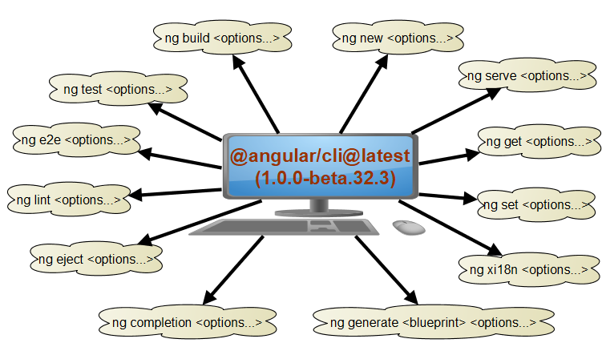
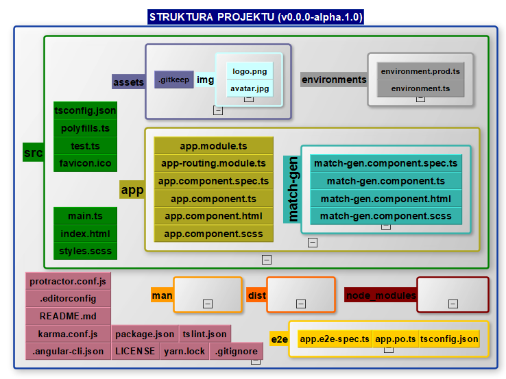

# DNA - Genos Ethnos Logos [https://cisowscy.github.io/DNA/]


## Development (co będzie potrzebne..)
-  [Node.js 7.5](https://nodejs.org/en/)
-  [Microsoft Visual Code](https://code.visualstudio.com/insiders) lub [Atom](https://atom.io/beta); przydatny może się okazać plugin do MSVscdoe [ngdoc](http://www.angulardoc.io)
-  [Chrome](https://www.google.pl/chrome/browser/canary.html) i plugin do debugowania Angulara [Augury](https://augury.angular.io/)
-  [yarn](https://yarnpkg.com/lang/en/)
-  [cmder](http://cmder.net/)
-  [git](https://git-scm.com/) oraz [SourceTree](https://www.sourcetreeapp.com/) i opcjonalnie [git flow](http://danielkummer.github.io/git-flow-cheatsheet/index.pl_PL.html)

następnie
```bash
$ npm i -g npm@latest
$ npm i -g @angular/cli@latest
$ git clone https://github.com/Cisowscy/DNA.git
$ cd DNA
$ yarn install
$ start https:\\localhost:4200\
$ ng serve 
```
Opcjonalnie jeśli podczas kompilacji wystpi nadal!! [błąd `Error Could not resolve module opaque_token ` może być potrzebne dodatkowe doinstalowanie CLI lokalnie (npm link)](https://github.com/angular/angular-cli/issues/4611)
```bash
$ npm i --save-dev @angular/cli@latest
```
# co ja tu kodzę ;)
Generalnie chcę utworzyć niezależne środowisko genealogiczno-genetyczne.. ale to kiedyś...

**Doraźny cel:** utworzyć aplikację o dwojakim biegu ( generowanie przykładowej rodziny lub import z gedcom) do wizualizacji przepływu dna, i kożyści płynących z zbadania konkretnych przedstawicieli rodziny 

> ## Czego używam
>
> Biblioteki: | [Google TypeScript Angular 4.0.0.beta-7](https://github.com/angular/angular/tree/4.0.0-beta.7) | [angular-material 2.0.0.beta-2](https://github.com/angular/material2/tree/2.0.0-beta.2) |
>
> Języki :  | [HTML (5.1/5.2)](https://www.w3.org/TR/html/)  |  [TypeScript (2.1.6)](https://www.typescriptlang.org/) | [SCSS (Sass 3.5)](http://sass-lang.com/) |
>
> KOMENDY: Angular CLI 1.0.0-beta.32.3 (szczegóły komend na dole strony)
> 

# STRUKTURA PROJEKTU
> 


-----
## KOMENDY ANGULAR CLI 1.0.0-beta.32.3

### `ng xi18n <options...>` Extracts i18n messages from source code.

```bash  
  --i18n-format (String) (Default: xlf)
    aliases: -f <value>, -xmb (--i18n-format=xmb), -xlf (--i18n-format=xlf), --xliff (--i18n-format=xlf), --i18nFormat <value>
  --output-path (Path) (Default: null)
    aliases: -op <value>, --outputPath <value>
  --verbose (Boolean) (Default: false)
    aliases: --verbose
  --progress (Boolean) (Default: true)
    aliases: --progress
```

### `ng version <options...>`  outputs Angular CLI version aliases: `v`, `--version`, `-v`

```bash    
  --verbose (Boolean) (Default: false)
    aliases: --verbose
```

### `ng test <options...>` Runs your app's test suite. aliases: `t`

```bash
    --watch (Boolean) (Default: true)
    aliases: -w, --watch
  --code-coverage (Boolean) (Default: false)
    aliases: -cc, --codeCoverage
  --config (String)
    aliases: -c <value>, --config <value>
  --single-run (Boolean) (Default: false)
    aliases: -sr, --singleRun
  --progress (Boolean) (Default: true)
    aliases: --progress
  --browsers (String)
    aliases: --browsers <value>
  --colors (Boolean)
    aliases: --colors
  --log-level (String)
    aliases: --logLevel <value>
  --port (Number)
    aliases: -port <value>
  --reporters (String)
    aliases: --reporters <value>
  --build (Boolean) (Default: true)
    aliases: --build
  --sourcemap (Boolean) (Default: true)
    aliases: -sm, --sourcemap
  --poll (Number) enable and define the file watching poll time period (milliseconds)
    aliases: -poll <value>
```

### `ng set <options...>` Set a value in the configuration.`--global` (Boolean) (Default: false) aliases: `-g`, `--global`

### `ng serve <options...>`  Builds and serves your app, rebuilding on file changes. aliases: `server`, `s`

```bash
 --target (String) (Default: development)
    aliases: -t <value>, -dev (--target=development), -prod (--target=production), --target <value>, --target <value>, --target <value>, --target <value>
  --environment (String)
    aliases: -e <value>, --environment <value>, --environment <value>, --environment <value>, --environment <value>
  --output-path (Path)
    aliases: -op <value>, --outputPath <value>, --outputPath <value>, --outputPath <value>, --outputPath <value>
  --aot (Boolean)
    aliases: -aot, -aot, -aot, -aot
  --sourcemap (Boolean)
    aliases: -sm, --sourcemaps, --sourcemap, --sourcemap, --sourcemap, --sourcemap
  --vendor-chunk (Boolean) (Default: true)
    aliases: -vc, --vendorChunk, --vendorChunk, --vendorChunk, --vendorChunk
  --base-href (String)
    aliases: -bh <value>, --baseHref <value>, --baseHref <value>, --baseHref <value>, --baseHref <value>
  --deploy-url (String)
    aliases: -d <value>, --deployUrl <value>, --deployUrl <value>, --deployUrl <value>, --deployUrl <value>
  --verbose (Boolean) (Default: false)
    aliases: -v, --verbose, --verbose, --verbose, --verbose
  --progress (Boolean) (Default: true)
    aliases: -pr, --progress, --progress, --progress, --progress
  --i18n-file (String)
    aliases: --i18nFile <value>, --i18nFile <value>, --i18nFile <value>, --i18nFile <value>
  --i18n-format (String)
    aliases: --i18nFormat <value>, --i18nFormat <value>, --i18nFormat <value>, --i18nFormat <value>
  --locale (String)
    aliases: --locale <value>, --locale <value>, --locale <value>, --locale <value>
  --extract-css (Boolean)
    aliases: -ec, --extractCss, --extractCss, --extractCss, --extractCss
  --watch (Boolean)
    aliases: -w, --watch, --watch, --watch, --watch
  --output-hashing=none|all|media|bundles (String) define the output filename cache-busting hashing mode
    aliases: -oh <value>, --outputHashing <value>, --outputHashing <value>, --outputHashing <value>, --outputHashing <value>
  --poll (Number) enable and define the file watching poll time period (milliseconds)
    aliases: -poll <value>, -poll <value>, -poll <value>, -poll <value>
  --port (Number) (Default: 4200)
    aliases: -p <value>, -port <value>, -port <value>
  --host (String) (Default: localhost) Listens only on localhost by default
    aliases: -H <value>, -host <value>, -host <value>
  --proxy-config (Path)
    aliases: -pc <value>, --proxyConfig <value>, --proxyConfig <value>
  --ssl (Boolean) (Default: false)
    aliases: -ssl, -ssl
  --ssl-key (String) (Default: ssl/server.key)
    aliases: --sslKey <value>, --sslKey <value>
  --ssl-cert (String) (Default: ssl/server.crt)
    aliases: --sslCert <value>, --sslCert <value>
  --open (Boolean) (Default: false) Opens the url in default browser
    aliases: -o, -open, -open
  --live-reload (Boolean) (Default: true)
    aliases: -lr, --liveReload
  --live-reload-host (String) Defaults to host
    aliases: -lrh <value>, --liveReloadHost <value>
  --live-reload-base-url (String) Defaults to baseURL
    aliases: -lrbu <value>, --liveReloadBaseUrl <value>
  --live-reload-port (Number) (Defaults to port number within [49152...65535])
    aliases: -lrp <value>, --liveReloadPort <value>
  --live-reload-live-css (Boolean) (Default: true) Whether to live reload CSS (default true)
    aliases: --liveReloadLiveCss
  --hmr (Boolean) (Default: false) Enable hot module replacement
    aliases: -hmr   
```

### `ng new <options...>` Creates a new directory and a new Angular app.

```bash
   --dry-run (Boolean) (Default: false)
    aliases: -d, --dryRun
  --verbose (Boolean) (Default: false)
    aliases: -v, --verbose
  --link-cli (Boolean) (Default: false)
    aliases: -lc, --linkCli
  --ng4 (Boolean) (Default: false)
    aliases: -ng4
  --skip-install (Boolean) (Default: false)
    aliases: -si, --skipInstall
  --skip-git (Boolean) (Default: false)
    aliases: -sg, --skipGit
  --skip-tests (Boolean) (Default: false)
    aliases: -st, --skipTests
  --skip-commit (Boolean) (Default: false)
    aliases: -sc, --skipCommit
  --directory (String)
    aliases: -dir <value>, --directory <value>
  --source-dir (String) (Default: src)
    aliases: -sd <value>, --sourceDir <value>
  --style (String) (Default: css)
    aliases: --style <value>
  --prefix (String) (Default: app)
    aliases: -p <value>, --prefix <value>
  --routing (Boolean) (Default: false)
    aliases: --routing
  --inline-style (Boolean) (Default: false)
    aliases: -is, --inlineStyle
  --inline-template (Boolean) (Default: false)
    aliases: -it, --inlineTemplate 
```

### `ng lint <options...>` Lints code in existing project  aliases: `l`

```bash
   --fix (Boolean) (Default: false)
    aliases: -fix
  --force (Boolean) (Default: false)
    aliases: --force
  --format (String) (Default: prose)
    aliases: --format <value> 
```

### `ng get <options...>` Get a value from the configuration. `--global` (Boolean) (Default: false) aliases: `--global`

### `ng generate <blueprint> <options...>` Generates new code from blueprints. aliases: `g`

```bash
  --dry-run (Boolean) (Default: false)
    aliases: -d, --dryRun
  --verbose (Boolean) (Default: false)
    aliases: -v, --verbose
  --pod (Boolean) (Default: false)
    aliases: -p, -pod
  --classic (Boolean) (Default: false)
    aliases: -c, --classic
  --dummy (Boolean) (Default: false)
    aliases: -dum, -id, --dummy
  --in-repo-addon (String) (Default: null)
    aliases: --in-repo <value>, -ir <value>, --inRepoAddon <value> 
```

### `ng eject <options...>` Ejects your app and output the proper webpack configuration and scripts.

```bash
  --target (String) (Default: development)
    aliases: -t <value>, -dev (--target=development), -prod (--target=production), --target <value>, --target <value>, --target <value>
  --environment (String)
    aliases: -e <value>, --environment <value>, --environment <value>, --environment <value>
  --output-path (Path)
    aliases: -op <value>, --outputPath <value>, --outputPath <value>, --outputPath <value>
  --aot (Boolean)
    aliases: -aot, -aot, -aot
  --sourcemap (Boolean)
    aliases: -sm, --sourcemaps, --sourcemap, --sourcemap, --sourcemap
  --vendor-chunk (Boolean) (Default: true)
    aliases: -vc, --vendorChunk, --vendorChunk, --vendorChunk
  --base-href (String)
    aliases: -bh <value>, --baseHref <value>, --baseHref <value>, --baseHref <value>
  --deploy-url (String)
    aliases: -d <value>, --deployUrl <value>, --deployUrl <value>, --deployUrl <value>
  --verbose (Boolean) (Default: false)
    aliases: -v, --verbose, --verbose, --verbose
  --progress (Boolean) (Default: true)
    aliases: -pr, --progress, --progress, --progress
  --i18n-file (String)
    aliases: --i18nFile <value>, --i18nFile <value>, --i18nFile <value>
  --i18n-format (String)
    aliases: --i18nFormat <value>, --i18nFormat <value>, --i18nFormat <value>
  --locale (String)
    aliases: --locale <value>, --locale <value>, --locale <value>
  --extract-css (Boolean)
    aliases: -ec, --extractCss, --extractCss, --extractCss
  --watch (Boolean)
    aliases: -w, --watch, --watch, --watch
  --output-hashing=none|all|media|bundles (String) define the output filename cache-busting hashing mode
    aliases: -oh <value>, --outputHashing <value>, --outputHashing <value>, --outputHashing <value>
  --poll (Number) enable and define the file watching poll time period (milliseconds)
    aliases: -poll <value>, -poll <value>, -poll <value>
  --force (Boolean)
    aliases: --force  
```

### `ng e2e <options...>` Run e2e tests in existing project aliases: `e`

```bash
     --target (String) (Default: development)
    aliases: -t <value>, -dev (--target=development), -prod (--target=production), --target <value>, --target <value>
  --environment (String)
    aliases: -e <value>, --environment <value>, --environment <value>
  --output-path (Path)
    aliases: -op <value>, --outputPath <value>, --outputPath <value>
  --aot (Boolean)
    aliases: -aot, -aot
  --sourcemap (Boolean)
    aliases: -sm, --sourcemaps, --sourcemap, --sourcemap
  --vendor-chunk (Boolean) (Default: true)
    aliases: -vc, --vendorChunk, --vendorChunk
  --base-href (String)
    aliases: -bh <value>, --baseHref <value>, --baseHref <value>
  --deploy-url (String)
    aliases: -d <value>, --deployUrl <value>, --deployUrl <value>
  --verbose (Boolean) (Default: false)
    aliases: -v, --verbose, --verbose
  --progress (Boolean) (Default: true)
    aliases: -pr, --progress, --progress
  --i18n-file (String)
    aliases: --i18nFile <value>, --i18nFile <value>
  --i18n-format (String)
    aliases: --i18nFormat <value>, --i18nFormat <value>
  --locale (String)
    aliases: --locale <value>, --locale <value>
  --extract-css (Boolean)
    aliases: -ec, --extractCss, --extractCss
  --watch (Boolean)
    aliases: -w, --watch, --watch
  --output-hashing=none|all|media|bundles (String) define the output filename cache-busting hashing mode
    aliases: -oh <value>, --outputHashing <value>, --outputHashing <value>
  --poll (Number) enable and define the file watching poll time period (milliseconds)
    aliases: -poll <value>, -poll <value>
  --port (Number) (Default: 4200)
    aliases: -p <value>, -port <value>
  --host (String) (Default: localhost) Listens only on localhost by default
    aliases: -H <value>, -host <value>
  --proxy-config (Path)
    aliases: -pc <value>, --proxyConfig <value>
  --ssl (Boolean) (Default: false)
    aliases: -ssl
  --ssl-key (String) (Default: ssl/server.key)
    aliases: --sslKey <value>
  --ssl-cert (String) (Default: ssl/server.crt)
    aliases: --sslCert <value>
  --open (Boolean) (Default: false) Opens the url in default browser
    aliases: -o, -open
  --config (String)
    aliases: -c <value>, --config <value>
  --specs (Array) (Default: )
    aliases: -sp <value>, --specs <value>
  --element-explorer (Boolean) (Default: false)
    aliases: -ee, --elementExplorer
  --webdriver-update (Boolean) (Default: true)
    aliases: -wu, --webdriverUpdate
  --serve (Boolean) (Default: true)
    aliases: -s, --serve

```

### `ng completion <options...>` Adds autocomplete functionality to `ng` commands and subcommands

```bash
 --all (Boolean) (Default: true)
    aliases: -a, -all
  --bash (Boolean) (Default: false)
    aliases: -b, -bash
  --zsh (Boolean) (Default: false)
    aliases: -z, -zsh  
```

### `ng build <options...>` Builds your app and places it into the output path (dist/ by default). aliases: `b`

```bash
  --target (String) (Default: development)
    aliases: -t <value>, -dev (--target=development), -prod (--target=production), --target <value>
  --environment (String)
    aliases: -e <value>, --environment <value>
  --output-path (Path)
    aliases: -op <value>, --outputPath <value>
  --aot (Boolean)
    aliases: -aot
  --sourcemap (Boolean)
    aliases: -sm, --sourcemaps, --sourcemap
  --vendor-chunk (Boolean) (Default: true)
    aliases: -vc, --vendorChunk
  --base-href (String)
    aliases: -bh <value>, --baseHref <value>
  --deploy-url (String)
    aliases: -d <value>, --deployUrl <value>
  --verbose (Boolean) (Default: false)
    aliases: -v, --verbose
  --progress (Boolean) (Default: true)
    aliases: -pr, --progress
  --i18n-file (String)
    aliases: --i18nFile <value>
  --i18n-format (String)
    aliases: --i18nFormat <value>
  --locale (String)
    aliases: --locale <value>
  --extract-css (Boolean)
    aliases: -ec, --extractCss
  --watch (Boolean)
    aliases: -w, --watch
  --output-hashing=none|all|media|bundles (String) define the output filename cache-busting hashing mode
    aliases: -oh <value>, --outputHashing <value>
  --poll (Number) enable and define the file watching poll time period (milliseconds)
    aliases: -poll <value>
  --stats-json (Boolean) (Default: false)
    aliases: --statsJson
  
```
-------------------